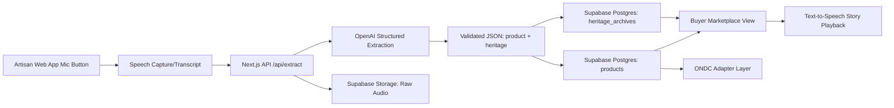

# KathaOS MVP
**Inclusive Cultural Commerce Engine**  
*A hackathon project bridging oral heritage and digital commerce infrastructure (ONDC-ready).*

## What is KathaOS?
KathaOS is a voice-first commerce and cultural archiving app for artisans.  
Instead of forms and typing, artisans speak naturally in their language.  
KathaOS extracts:

1. **Commerce data** (title, category, materials, price, summary) for marketplace listing.
2. **Heritage data** (story, significance, region) for preserving oral cultural memory.

This MVP proves that traditional knowledge can become a structured, ownable digital asset without forcing digital fluency barriers.

---

## Problem We Solve
Many artisans are excluded from digital marketplaces because onboarding expects literacy, typing, and app fluency.  
At the same time, oral cultural context behind handmade products is lost in standard e-commerce flows.

KathaOS solves both by:
- **Zero-UI input:** one microphone button, no forms.
- **Dual-output AI pipeline:** commerce + heritage extraction.
- **Buyer storytelling layer:** interactive "Listen to Story" experience.
- **ONDC alignment:** structured product data ready for integration.

---

## MVP Capabilities

### 1) Artisan Voice Input (Zero-UI)
- Single large mic button on web app
- Browser captures/transcribes artisan speech
- Transcript sent to backend extraction API

### 2) AI Extraction Engine
- OpenAI Structured Output + Zod schema
- Deterministic extraction into:
  - `product` object (commerce)
  - `heritage` object (cultural narrative)
- Minimal hallucination via strict schema + low temperature

### 3) Dual Database Storage (Supabase)
- `products` table -> marketplace-ready catalog data
- `heritage_archives` table -> cultural story archive linked to product
- Raw audio reference stored in Supabase Storage

### 4) Buyer Cultural Experience
- Buyer sees product card
- "Interactive Heritage Guide" includes "Listen to Story"
- Browser text-to-speech narrates cultural significance
- Product data model designed for adapter-based mapping to ONDC payloads

---

## Architecture Overview



---

## Tech Stack

| Layer | Technology |
|---|---|
| Frontend | Next.js 14 (App Router), React, Tailwind CSS |
| Voice Input | Web Speech API (browser-native) |
| AI Extraction | OpenAI GPT-4o Structured Output + Zod |
| Database | Supabase (PostgreSQL + Storage) |
| ONDC Adapter | Custom mapping layer |

---

## Project Structure

```
katha-os-mvp/
  app/
    artisan/            # Artisan-facing pages
      record/           # Voice recording page (zero-UI mic)
    buyer/              # Buyer-facing pages
      [productId]/      # Individual product + heritage story
    api/
      extract/          # POST: transcript -> structured extraction
      products/         # CRUD: product catalog
      heritage/         # CRUD: heritage archives
  components/
    ui/                 # Shared UI primitives (Button, Card, etc.)
    artisan/            # Artisan-specific components (MicButton, etc.)
    buyer/              # Buyer-specific components (StoryPlayer, etc.)
    shared/             # Cross-role components
  lib/
    ai/                 # OpenAI extraction logic
    supabase/           # Supabase client + queries
    schemas/            # Zod schemas (product, heritage, extraction)
    ondc/               # ONDC payload adapter
    hooks/              # Custom React hooks (useSpeechRecognition, etc.)
    utils/              # Helpers
  supabase/
    migrations/         # SQL migrations
  types/                # TypeScript type definitions
  public/               # Static assets
```

---

## Database Schema (Supabase)

### products
| Column | Type | Description |
|---|---|---|
| id | uuid | Primary key |
| title | text | Product name |
| category | text | Product category |
| materials | text[] | Array of materials |
| price | numeric | Price in INR |
| summary | text | Short commerce description |
| image_url | text | Optional product image |
| transcript_raw | text | Original artisan speech |
| created_at | timestamptz | Creation timestamp |

### heritage_archives
| Column | Type | Description |
|---|---|---|
| id | uuid | Primary key |
| product_id | uuid | FK -> products.id |
| story | text | Cultural narrative |
| significance | text | Why it matters |
| region | text | Geographic origin |
| language | text | Language spoken |
| audio_url | text | Reference to raw audio |
| created_at | timestamptz | Creation timestamp |

---

## Getting Started

```bash
# 1. Clone
git clone <repo-url>
cd katha-os-mvp

# 2. Install
npm install

# 3. Configure
cp .env.example .env.local
# Fill in Supabase + OpenAI keys

# 4. Run migrations
npx supabase db push

# 5. Start dev
npm run dev
```

---

## Environment Variables

```env
# Supabase
NEXT_PUBLIC_SUPABASE_URL=your-project-url
NEXT_PUBLIC_SUPABASE_ANON_KEY=your-anon-key

# OpenAI
OPENAI_API_KEY=your-openai-key
```

---

## ONDC Integration
The `lib/ondc/` adapter layer maps extracted product data to ONDC catalog schema.  
This makes every voice-captured product structurally compatible with ONDC network onboarding without additional manual mapping.

---

## License
MIT
